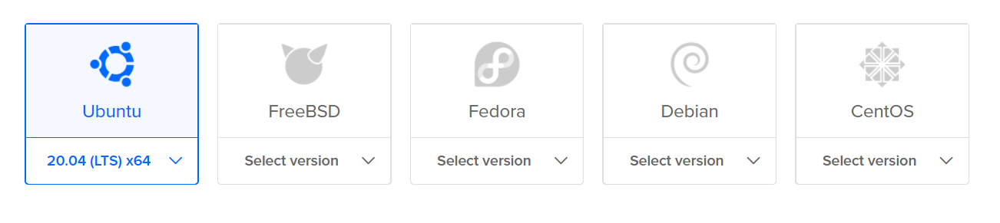
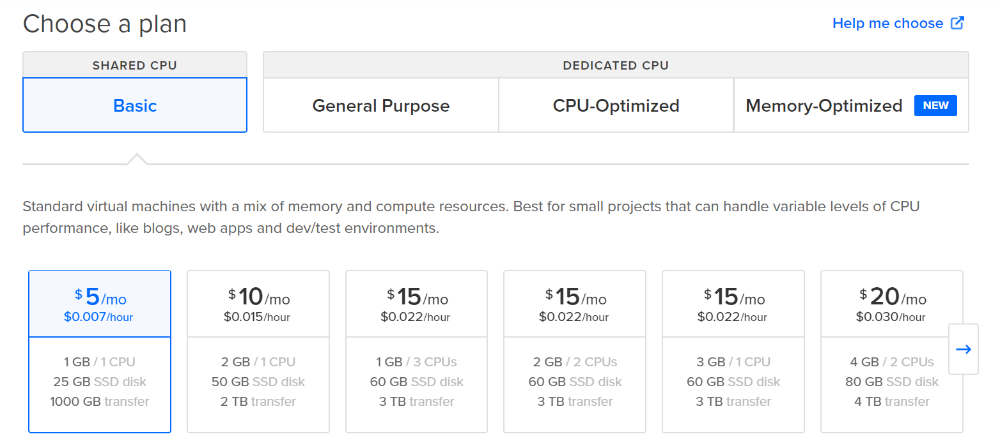
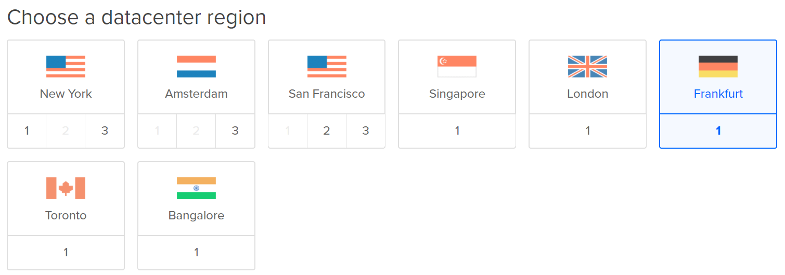
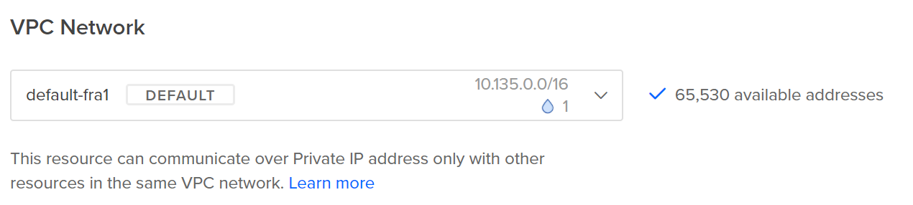
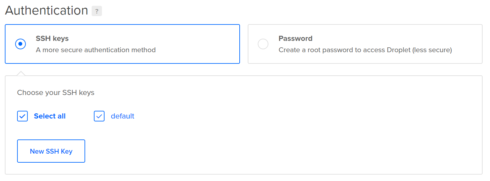
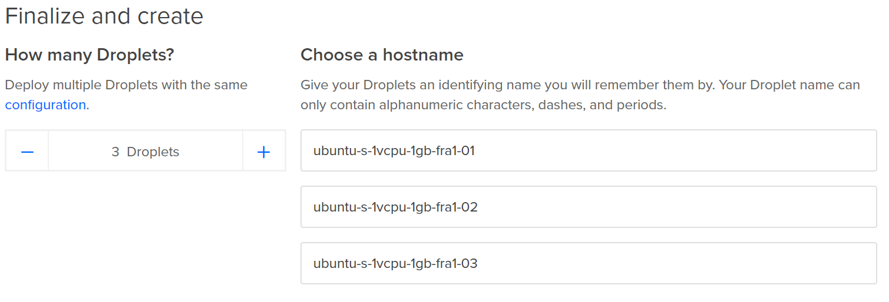
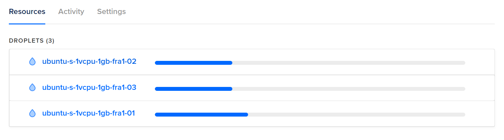
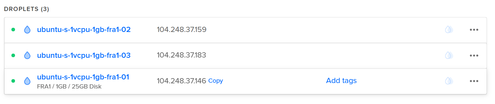

I often need a Kubernetes cluster(now that's quite a sentence) for testing something or doing a proof of concept. I find that working in quite the corporate setup, commissioning a new cluster isn't just a thing you do even if it's all automated. After a bit of frustration about this, I turned to the internet thinking "I'll just set this up on AWS or Azure for this POC". Of course, that's very viable, however, if you just need 3 VMs for setting something up, DigitalOcean is second to none in terms of speed of delivery and ease of use.

So, that's what we're gonna look at here.

## Prerequisites

- An account with DigitalOcean (here's a referral link giving you 100$ credit and me 25$ (https://m.do.co/c/470520cd0871))
- Kubectl installed on your local machine. Look [here](https://kubernetes.io/docs/tasks/tools/install-kubectl/) for a lot of options
- A public key added to your DigitalOcean account for authenticating towards the VMs. [Here's a guide from DO](https://www.digitalocean.com/docs/droplets/how-to/add-ssh-keys/create-with-openssh/)
- Downloaded the k3sup executable to your machine from [here](https://github.com/alexellis/k3sup/releases)

## Getting started

Well, we want a cluster, so let's go and create some VMs (Droplets in DigitalOcean terms). Let's create 3.

As k3s is a lightweight Kubernetes distribution, we can use any VM size. We're going to run on Ubuntu 20.04 LTS. This is probably not the preferred distribution for production use, but the sake of this, it's great!



I'm using the smallest (cheapest, $5/month) which is perfectly responsive for this purpose.



The location doesn't really matter for this purpose, so I'll create them in Frankfurt because it's fairly close to me.



I'm using a default VPC in which all my machines in Frankfurt are placed. This is to enable the VMs to communicate easily with each other. **You probably shouldn't do this for production purposes**.



I use the previously mentioned SSH key to authenticate with the VMs. k3sup doesn't support password authentication so this is required. And much easier.



I create 3 instances and as mentioned, I don't care about the naming as we'll just scrap them later on.



Add them to a project. Name it something - for instance "k3sup test".

Press "Create Droplet". The machines should be ready in ~1 minute. **Success!**



## Installing Kubernetes

Now we're ready! The fun starts now. Let's install Kubernetes on the master node. You can just choose any of the machines you just created and copy it's IP address.



Go to you terminal and navigate to where you've placed the k3sup executable. I'm running on Windows and have mine in c:/tools/k3sup.

Execute the following command:

```
k3sup install --ip the-ip-you-copied
```

You may be prompted for the password for the ssh key. Enter it.

While installing, k3sup will output what's happening. When it's done, you should see a message confirming the success and you should have a kubeconfig in the current directory. Try running

```
dir
```
To confirm this.

Let's verify that the node has been added and is ready before continuing.

```
kubectl --kubeconfig=KUBECONFIG get nodes
```

This should return a list of nodes containing the master node you've just added.

### Worker nodes

Let's proceed to adding the worker nodes to the cluster.

Copy the IP of another VM and run the following command

```
k3sup join --server-ip ip-of-server-node --ip ip-of-worker-node
```

You might be prompted again to provide ssh key password.

You should now see a log of k3sup installing Kubernetes and joining the node into the cluster.

Use the previous command once again to verify that the node has been added.

```
kubectl --kubeconfig=KUBECONFIG get nodes
```

Now copy the IP of the last VM and run the *k3sup join* command once again.

You should now have a cluster with 3 nodes, 1 master and two workers.


